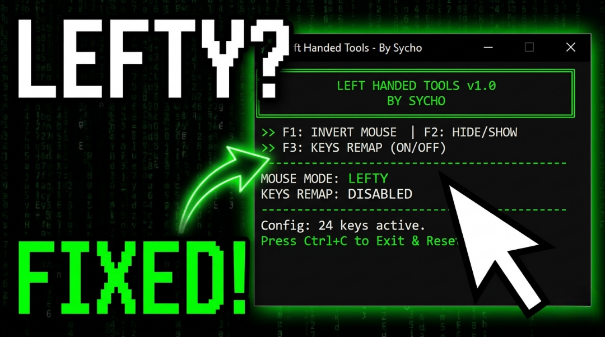

# LeftHandedTools v1.0 🖱️⌨️

A powerful and lightweight utility developed in Python to help left-handed gamers adapt any game to their needs. Easily swap mouse buttons, remap keys, and manage configurations with a retro-style terminal interface.

---

## 📺 Demo Video

*Click the image above to see the tool in action!*

---

## 🚀 Main Features

- **Invert Mouse (F1):** Instantly swap Left and Right mouse buttons.
- **Stealth Mode (F2):** Hide or show the console window to keep your workspace clean while gaming.
- **Keys Remap (F3):** Enable or disable custom keyboard remapping for 24 specific keys designed for southpaw setups.
- **Persistent Config:** All settings are saved in a `config.json` file (UTF-8 support).

---

## 📸 Program Interface

---

## 📥 Installation & Usage

1. Go to the **[Releases](https://github.com/EtherealDevv/LeftHandedTools/releases)** section.
2. Download `LeftHandedTools.exe`.
3. Run the executable (No installation required).
4. Follow the initial wizard to set up your preferred keys.
5. Use the Hotkeys (**F1, F2, F3**) to control the tool in real-time.

---

## 🛠️ Built With

- **Python 3.x**
- **Win32API / PyWin32:** For low-level hardware interaction.
- **Keyboard Library:** For global hotkey management.

---

## 👤 Author

**Sycho** - *Initial Work & Development* - [EtherealDevv](https://github.com/EtherealDevv)

---

## 📄 License

This project is licensed under the MIT License - see the [LICENSE](LICENSE) file for details.
