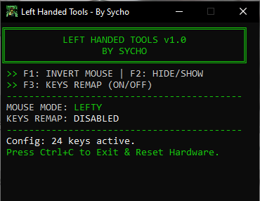
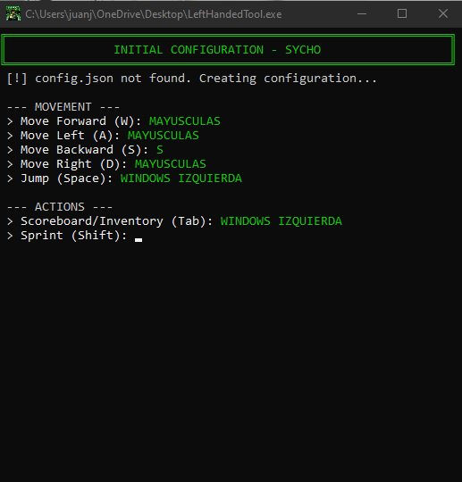

# ⌨️ LeftHandedTools v1.0

**LeftHandedTools** is a powerful, lightweight utility designed for left-handed gamers to instantly swap mouse buttons and remap all standard keyboard controls. It features a minimalist retro-style interface, structured JSON configurations with UTF-8 support, and advanced stealth mode functionality.

## 🚀 Program Interface
This is the main interface of the tool in action, showing the current status of mouse inversion, key remapping, and the number of active keys.



## 🛠️ Initial Configuration Wizard
When running the tool for the first time, a step-by-step wizard guides you to assign your physical keys to your preferred virtual controls, creating your custom `config.json`.



## 🎮 How to Use
1. Download the latest `.exe` from the [Releases](https://github.com/EtherealDevv/LeftHandedTools/releases) page.
2. **Run as Administrator:** This is required for the tool to intercept and remap keys inside games.
3. Follow the initial wizard for first-time setup.
4. **Hotkeys:**
    * **F1:** Swap Mouse Buttons (Toggle).
    * **F2:** Window Visibility (Hide/Show).
    * **F3:** Keyboard Remapping (Toggle).

---

## 📦 Developer Guide (Building from Source)
If you want to modify or compile the tool from source, ensure you have Python 3.x and the `keyboard` library installed:

```bash
pip install keyboard
